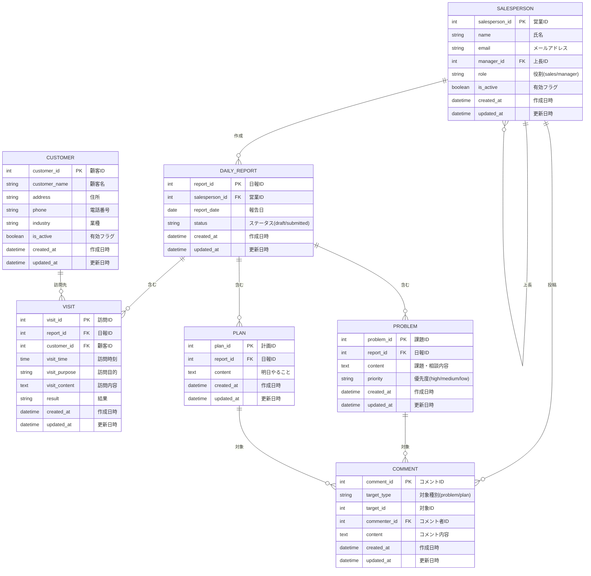

# 営業日報システム 要件定義書

## 1. 文書情報

| 項目       | 内容                        |
| ---------- | --------------------------- |
| 文書名     | 営業日報システム 要件定義書 |
| バージョン | 1.0                         |
| 作成日     | 2026-02-15                  |
| 最終更新日 | 2026-02-15                  |

---

## 2. システム概要

### 2.1 目的

営業担当者が日々の顧客訪問活動を報告し、上長がフィードバックを行うことで、営業活動の可視化とコミュニケーションの円滑化を図る。

### 2.2 システム名

営業日報システム（Daily Sales Report System）

### 2.3 対象ユーザー

- 営業担当者
- 上長（マネージャー）
- システム管理者

---

## 3. 用語定義

| 用語     | 定義                                       |
| -------- | ------------------------------------------ |
| 日報     | 営業担当者が1日の活動内容をまとめた報告書  |
| 訪問記録 | 顧客への訪問1件ごとの詳細情報              |
| Problem  | 現在抱えている課題や上長への相談事項       |
| Plan     | 翌営業日に予定している活動内容             |
| コメント | 上長がProblem/Planに対して付ける助言・指示 |

---

## 4. 機能要件

### 4.1 日報管理機能

#### 4.1.1 日報作成

| 項目       | 内容                                                                                                   |
| ---------- | ------------------------------------------------------------------------------------------------------ |
| 概要       | 営業担当者が日報を新規作成する                                                                         |
| アクター   | 営業担当者                                                                                             |
| 事前条件   | ユーザーがログイン済みであること                                                                       |
| 基本フロー | 1. 報告日を選択（デフォルト：当日） 2. 訪問記録を入力 3. Problem/Planを入力 4. 保存または提出 |
| 事後条件   | 日報が保存される                                                                                       |
| 備考       | 同一日付の日報は1件のみ作成可能                                                                        |

#### 4.1.2 日報編集

| 項目       | 内容                                                  |
| ---------- | ----------------------------------------------------- |
| 概要       | 作成済みの日報を編集する                              |
| アクター   | 営業担当者                                            |
| 事前条件   | 対象の日報が存在すること                              |
| 基本フロー | 1. 日報一覧から対象を選択 2. 内容を編集 3. 保存 |
| 備考       | 提出済みの日報は編集不可（要検討）                    |

#### 4.1.3 日報閲覧

| 項目       | 内容                                                 |
| ---------- | ---------------------------------------------------- |
| 概要       | 日報の内容を閲覧する                                 |
| アクター   | 営業担当者、上長                                     |
| 事前条件   | 閲覧権限があること                                   |
| 基本フロー | 1. 日報一覧から対象を選択 2. 詳細画面で内容を確認 |

### 4.2 訪問記録機能

#### 4.2.1 訪問記録登録

| 項目     | 内容                                                                                         |
| -------- | -------------------------------------------------------------------------------------------- |
| 概要     | 顧客訪問の詳細を記録する                                                                     |
| アクター | 営業担当者                                                                                   |
| 入力項目 | - 顧客（顧客マスタから選択） - 訪問時刻 - 訪問目的 - 訪問内容（自由記述） - 結果 |
| 備考     | 1日報に対して複数件登録可能                                                                  |

### 4.3 Problem/Plan機能

#### 4.3.1 Problem登録

| 項目     | 内容                                       |
| -------- | ------------------------------------------ |
| 概要     | 現在の課題・相談事項を登録する             |
| アクター | 営業担当者                                 |
| 入力項目 | - 内容（自由記述） - 優先度（高/中/低） |
| 備考     | 1日報に対して複数件登録可能                |

#### 4.3.2 Plan登録

| 項目     | 内容                        |
| -------- | --------------------------- |
| 概要     | 翌営業日の予定を登録する    |
| アクター | 営業担当者                  |
| 入力項目 | - 内容（自由記述）          |
| 備考     | 1日報に対して複数件登録可能 |

### 4.4 コメント機能

#### 4.4.1 コメント投稿

| 項目     | 内容                                      |
| -------- | ----------------------------------------- |
| 概要     | Problem/Planに対してコメントを投稿する    |
| アクター | 上長                                      |
| 事前条件 | 対象のProblem/Planが存在すること          |
| 入力項目 | - コメント内容（自由記述）                |
| 備考     | 1つのProblem/Planに対して複数コメント可能 |

### 4.5 マスタ管理機能

#### 4.5.1 顧客マスタ管理

| 項目     | 内容                                                       |
| -------- | ---------------------------------------------------------- |
| 概要     | 顧客情報を登録・編集・削除する                             |
| アクター | システム管理者                                             |
| 管理項目 | - 顧客名 - 住所 - 電話番号 - 業種 - 有効フラグ |

#### 4.5.2 営業マスタ管理

| 項目     | 内容                                                                        |
| -------- | --------------------------------------------------------------------------- |
| 概要     | 営業担当者・上長の情報を登録・編集・削除する                                |
| アクター | システム管理者                                                              |
| 管理項目 | - 氏名 - メールアドレス - 上長 - 役割（営業/上長） - 有効フラグ |

---

## 5. 非機能要件

### 5.1 性能要件

| 項目             | 要件              |
| ---------------- | ----------------- |
| レスポンスタイム | 画面表示：3秒以内 |
| 同時接続数       | 50ユーザー以上    |

### 5.2 可用性要件

| 項目       | 要件             |
| ---------- | ---------------- |
| 稼働時間   | 平日 8:00〜22:00 |
| 目標稼働率 | 99%以上          |

### 5.3 セキュリティ要件

| 項目       | 要件                     |
| ---------- | ------------------------ |
| 認証       | ID/パスワード認証        |
| 認可       | ロールベースアクセス制御 |
| 通信       | HTTPS必須                |
| パスワード | ハッシュ化して保存       |

### 5.4 ユーザビリティ要件

| 項目         | 要件                           |
| ------------ | ------------------------------ |
| 対応ブラウザ | Chrome, Edge, Safari（最新版） |
| レスポンシブ | PC、タブレット対応             |

---

## 6. 画面一覧

| No  | 画面ID  | 画面名         | 概要                     |
| --- | ------- | -------------- | ------------------------ |
| 1   | SCR-001 | ログイン画面   | システムへのログイン     |
| 2   | SCR-002 | ダッシュボード | 日報一覧・サマリー表示   |
| 3   | SCR-003 | 日報作成画面   | 日報の新規作成・編集     |
| 4   | SCR-004 | 日報詳細画面   | 日報内容の閲覧・コメント |
| 5   | SCR-005 | 顧客マスタ画面 | 顧客情報の管理           |
| 6   | SCR-006 | 営業マスタ画面 | 営業担当者情報の管理     |

---

## 7. データ要件

### 7.1 ER図

### 7.2 テーブル定義

#### SALESPERSON（営業マスタ）

| カラム名       | 型           | NULL | キー | 説明                        |
| -------------- | ------------ | ---- | ---- | --------------------------- |
| salesperson_id | INT          | NO   | PK   | 営業ID                      |
| name           | VARCHAR(100) | NO   |      | 氏名                        |
| email          | VARCHAR(255) | NO   | UQ   | メールアドレス              |
| manager_id     | INT          | YES  | FK   | 上長ID（自己参照）          |
| role           | VARCHAR(20)  | NO   |      | 役割（sales/manager/admin） |
| is_active      | BOOLEAN      | NO   |      | 有効フラグ                  |
| created_at     | DATETIME     | NO   |      | 作成日時                    |
| updated_at     | DATETIME     | NO   |      | 更新日時                    |

#### CUSTOMER（顧客マスタ）

| カラム名      | 型           | NULL | キー | 説明       |
| ------------- | ------------ | ---- | ---- | ---------- |
| customer_id   | INT          | NO   | PK   | 顧客ID     |
| customer_name | VARCHAR(200) | NO   |      | 顧客名     |
| address       | VARCHAR(500) | YES  |      | 住所       |
| phone         | VARCHAR(20)  | YES  |      | 電話番号   |
| industry      | VARCHAR(100) | YES  |      | 業種       |
| is_active     | BOOLEAN      | NO   |      | 有効フラグ |
| created_at    | DATETIME     | NO   |      | 作成日時   |
| updated_at    | DATETIME     | NO   |      | 更新日時   |

#### DAILY_REPORT（日報）

| カラム名       | 型          | NULL | キー | 説明                          |
| -------------- | ----------- | ---- | ---- | ----------------------------- |
| report_id      | INT         | NO   | PK   | 日報ID                        |
| salesperson_id | INT         | NO   | FK   | 営業ID                        |
| report_date    | DATE        | NO   |      | 報告日                        |
| status         | VARCHAR(20) | NO   |      | ステータス（draft/submitted） |
| created_at     | DATETIME    | NO   |      | 作成日時                      |
| updated_at     | DATETIME    | NO   |      | 更新日時                      |

※ salesperson_id + report_date でユニーク制約

#### VISIT（訪問記録）

| カラム名      | 型           | NULL | キー | 説明     |
| ------------- | ------------ | ---- | ---- | -------- |
| visit_id      | INT          | NO   | PK   | 訪問ID   |
| report_id     | INT          | NO   | FK   | 日報ID   |
| customer_id   | INT          | NO   | FK   | 顧客ID   |
| visit_time    | TIME         | YES  |      | 訪問時刻 |
| visit_purpose | VARCHAR(100) | YES  |      | 訪問目的 |
| visit_content | TEXT         | NO   |      | 訪問内容 |
| result        | VARCHAR(100) | YES  |      | 結果     |
| created_at    | DATETIME     | NO   |      | 作成日時 |
| updated_at    | DATETIME     | NO   |      | 更新日時 |

#### PROBLEM（課題・相談）

| カラム名   | 型          | NULL | キー | 説明                      |
| ---------- | ----------- | ---- | ---- | ------------------------- |
| problem_id | INT         | NO   | PK   | 課題ID                    |
| report_id  | INT         | NO   | FK   | 日報ID                    |
| content    | TEXT        | NO   |      | 課題・相談内容            |
| priority   | VARCHAR(10) | NO   |      | 優先度（high/medium/low） |
| created_at | DATETIME    | NO   |      | 作成日時                  |
| updated_at | DATETIME    | NO   |      | 更新日時                  |

#### PLAN（計画）

| カラム名   | 型       | NULL | キー | 説明         |
| ---------- | -------- | ---- | ---- | ------------ |
| plan_id    | INT      | NO   | PK   | 計画ID       |
| report_id  | INT      | NO   | FK   | 日報ID       |
| content    | TEXT     | NO   |      | 明日やること |
| created_at | DATETIME | NO   |      | 作成日時     |
| updated_at | DATETIME | NO   |      | 更新日時     |

#### COMMENT（コメント）

| カラム名     | 型          | NULL | キー | 説明                     |
| ------------ | ----------- | ---- | ---- | ------------------------ |
| comment_id   | INT         | NO   | PK   | コメントID               |
| target_type  | VARCHAR(20) | NO   |      | 対象種別（problem/plan） |
| target_id    | INT         | NO   |      | 対象ID                   |
| commenter_id | INT         | NO   | FK   | コメント者ID             |
| content      | TEXT        | NO   |      | コメント内容             |
| created_at   | DATETIME    | NO   |      | 作成日時                 |
| updated_at   | DATETIME    | NO   |      | 更新日時                 |

---

## 8. 外部インターフェース

### 8.1 外部システム連携

| 連携先             | 連携方式 | 連携内容       |
| ------------------ | -------- | -------------- |
| （将来検討）CRM    | API      | 顧客情報の同期 |
| （将来検討）メール | SMTP     | 通知メール送信 |

---

## 9. 制約事項

1. 初期リリースではモバイルアプリは対象外（Webブラウザのみ）
2. 多言語対応は対象外（日本語のみ）
3. オフライン機能は対象外

---

## 10. 今後の検討事項

- [ ] 日報の承認ワークフロー追加
- [ ] 訪問記録に商談金額・受注確度の追加
- [ ] 部署マスタの追加（組織階層対応）
- [ ] ファイル添付機能
- [ ] 通知機能（メール/Slack連携）
- [ ] レポート・分析機能

---

## 改訂履歴

| バージョン | 日付       | 変更内容 | 担当者 |
| ---------- | ---------- | -------- | ------ |
| 1.0        | 2026-02-15 | 初版作成 | -      |
